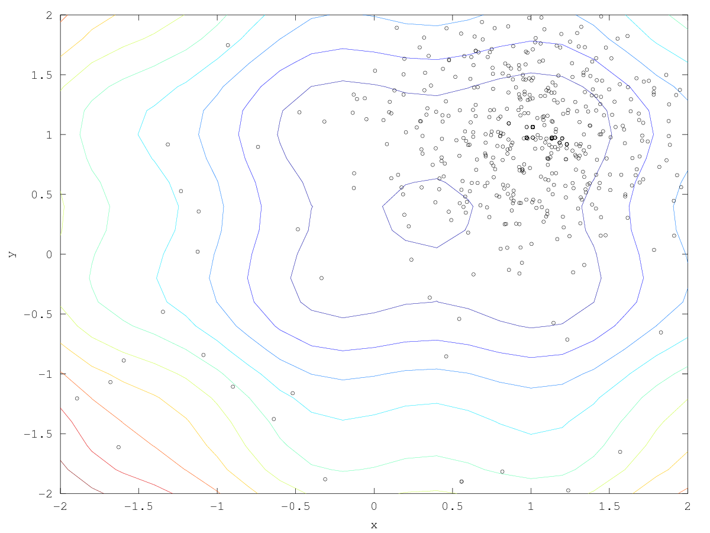
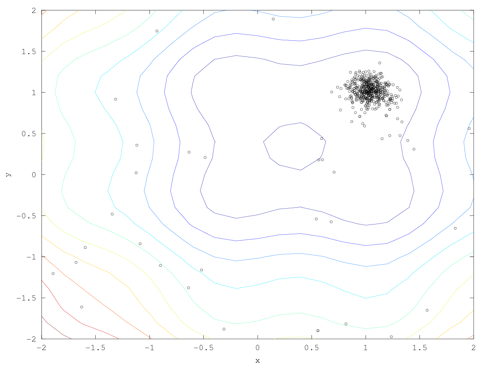

= DEAP Example

== Overview

This runs a real EA with http://deap.readthedocs.io/en/master[DEAP].  The objective function is simply:

_sin(4x) + sin(4y) - 2x + x² - 2y + y²_

== Installation

Clone EQ-Py and install it into the ext/ directory.

----
$ git clone git@github.com:emews/mela.git
$ git clone git@github.com:emews/EQ-Py.git
$ cd mela/deap # This example
$ ../../EQ-Py/src/install ext/EQ-Py
...
file creation messages
...
----

== Run

Run with:

----
$ cd mela/deap # This example
$ swift/run --settings=swift/settings.json > run.log
----

== Objective function

The objective function, +f()+ is expressed as:

Python: https://github.com/emews/mela/blob/master/deap/swift/workflow.swift[workflow.swift]

Tcl: https://github.com/emews/mela/blob/master/deap/Tcl/Tcl-Task/task.tcl[task.tcl]

For plotting in https://github.com/emews/EQ-Py/blob/master/examples/ga0/plots/f.m[f.m]
(see below for plotting information).

== Plot

. Simply generate +run.log+ as described above.
. Then use +create-xyz.tcl+ to create Octave-compatible vectors
. Then use +trajectory.m+ to make the plot

=== File index

In the +plots/+ directory:

==== Entry points

* +create-xyz.tcl+: Scans the Swift output and creates Octave-compatible data files {x,y,z}.dat .  These are the points sampled by DEAP. Usage:
+
----
cd plots
./create-xyz.tcl < run.log
----
+
* +trajectory.m+: Combines the contour plot with data points from {x,y,z}.dat.  Creates +plot.png+. Usage:
+
----
cd plots
octave trajectory.m
----

==== Supporting files

* +f.m+: The implementation of the objective function in Octave, used only for visualization
* +show_f.m+: Make a contour plot from +f.m+

=== Example output images

// align=center only works in HTML output, not on GitHub

. Run with σ = 0.5:
+

+
. Run with σ = 0.1:
+

